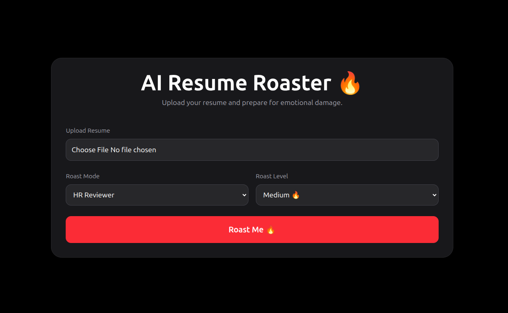
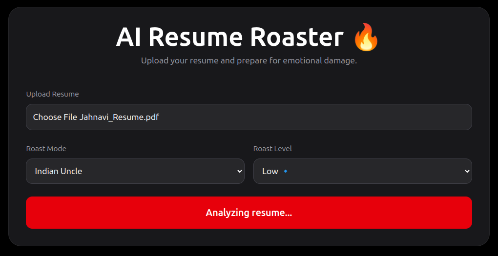

# AI Resume Roaster 🔥

An AI-powered resume roasting platform that turns boring resumes into emotional damage.

Upload your resume PDF, choose a roast personality, select roast intensity, and let the AI destroy your career choices in style.

Built with React, TailwindCSS, Node.js, Express, and LLM APIs.

---

# ✨ Features

- 📄 Resume PDF Upload
- 🤖 AI Generated Resume Roasts
- 🎭 Multiple Roast Personalities
- ☠️ Roast Intensity Levels
- 🔊 Text-to-Speech Roast Narration
- 📥 Download Roast as PDF
- ⚡ Dynamic AI Loading States
- 🌙 Modern Dark UI
- 🧠 Prompt Engineered Responses

---

# 🎭 Roast Modes

- HR Reviewer
- Best Friend
- FAANG Recruiter
- Savage Roaster
- Gen Z Mode
- Indian Uncle

---

# 🔥 Roast Levels

- Low 🔹
- Medium 🔥
- Hard ☠️

---

# 🛠️ Tech Stack

## Frontend
- React
- TailwindCSS
- JavaScript
- jsPDF

## Backend
- Node.js
- Express.js
- Multer
- pdf-parse

## AI
- OpenRouter API
- Prompt Engineering

---

# 📸 Screenshots

## Home Screen



---

## Loading State



---

## Roast Result


## Download


---

# ⚙️ Setup Instructions

## Clone Repository

```bash
git clone <your-repo-url>